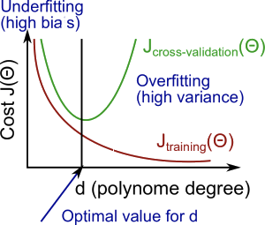
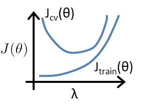
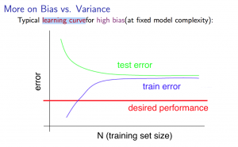
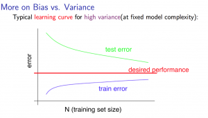

之前介绍了几种不同的监督学习算法：

- [线性回归](https://www.jianshu.com/p/258a12d263d0)
- [Logistic 回归](https://www.jianshu.com/p/d5491293bcaf)
- [神经网络模型](https://www.jianshu.com/p/0c5ad8a172d1)

但是有时将模型训练出来之后，会发现模型与实际之间的误差还是很大的，这时应该怎么办呢，这篇文章就介绍一下可以从哪些角度考虑模型的优化。一般来说，有以下角度：

- 向数据集中添加更多的数据
- 减少特征的数量
- 尝试更多不同的特征
- 尝试使用多项式特征
- 增加或减少正则化参数 λ

下面具体地介绍一下分析误差的方法

### 测试集（Test Set）

对于我们训练出的模型来说，并不是误差越小越好，因为这样也可能导致过拟合，那么怎么判断是不是过拟合了呢，方法是将数据集分为两部分：训练集和**测试集（Test Set）**，分的比例大致是 70% 和 30%，使用训练集中的数据最小化损失函数，得到最优化的参数，再使用这组参数计算测试集上的损失函数值。比如对于线性回归模型，测试集上的损失函数计算：

$$J_{test}(\Theta) = \dfrac{1}{2m_{test}} \sum_{i=1}^{m_{test}}(h_\Theta(x^{(i)}_{test}) - y^{(i)}_{test})^2$$

对于分类问题，我们计算测试集上的损失函数时可以使用：

$$err(h_\Theta(x),y) = \begin{matrix} 1 & \mbox {if } h_\Theta(x) \geq 0.5\ and\ y = 0\ or\ h_\Theta(x) < 0.5\ and\ y = 1\newline 0 & \mbox otherwise \end{matrix}$$

$$\text{Test Error} = \dfrac{1}{m_{test}} \sum^{m_{test}}_{i=1} err(h_\Theta(x^{(i)}_{test}), y^{(i)}_{test})$$

这样我们就可以得到测试集中被错误分类的数据的比例

如果模型出现了过拟合的情况，则会在训练集上有较小的损失函数值，而在测试集上有较大的损失函数。因此，使用测试集，我们就可以评估我们在训练集上训练出的模型的误差

### 验证集（Validation Set）

还会遇到这种情况，我们建立了不同的模型，比如一次模型，二次，三次多项式模型，然后对每个模型都在训练集上训练出了最优的参数，现在我们如何从中选择到底使用模型并且评估它的误差呢。一种方法是，我们可以将这些模型在测试集上面运行，然后看哪个的误差最小，这样我们就选出了模型，但是我们如何评估这个模型的误差呢，如果继续使用测试集来评估误差的话，误差肯定会比较小因为之前选择模型的时候就已经使用过测试集了。

因此，一般我们会将数据集分为三部分：训练集，**验证集（Validation set）**，测试集，比例一般为 60%, 20%, 20%，选择模型的步骤为：先在训练集上对每个模型求出最优的参数；然后使用验证集选择出误差最小的模型，这一步骤也叫做**交叉验证（Cross-Validation）**；最后使用测试集评估这个选择出的模型的误差

### 判断欠拟合和过拟合

在过拟合（High variance）和欠拟合（High bias）的情况下，模型的误差都会很大，判断到底是属于哪种情况有助于我们优化模型，那么怎么判断到底是欠拟合还是过拟合呢。我们先来看一下在欠拟合，刚好拟合，和过拟合的情况下，训练集和验证集上的误差变化情况：

欠拟合的情况下，模型即使在训练集上也不能很好的拟合，因此在训练集和验证集上的误差都很高，刚好拟合的情况下，两者的误差都很低，而在过拟合的情况下，模型很好的拟合了训练集，但是在验证集上的误差依然很大，这样我们就可以通过模型在训练集和验证集上的误差来判断模型到底是欠拟合还是过拟合。

同样，在选择正则化参数$\lambda$的时候，我们也可以使用验证集帮助我们选择出最好的$\lambda$值，方法是使用不同的$\lambda$值训练出多个模型，比如： 取λ∈{0,0.01,0.02,0.04,0.08,0.16,0.32,0.64,1.28,2.56,5.12,10.24}。然后在验证集上选择出误差最小的模型，最后使用测试集评估模型的误差。对于$\lambda$变化的情况下，欠拟合和过拟合的判断，图像如下：

### 学习曲线（Learning Curves）

使用验证集，我们可以进行不同特征的选择，以及正则化参数的选择，接下来我们还需要知道是否应该向数据集中添加更多的数据，我们可以使用**学习曲线（Learning Curves）**

学习曲线（Learning Curves），反映了训练集和验证集的误差随着数据的增加而改变的趋势，下图分别是模型在欠拟合和过拟合情况下的学习曲线：

可以看到，当模型面临欠拟合的问题时，增加数据并不能解决欠拟合的问题，当模型过拟合时，增加数据可能会有所帮助

总结一下之前提到的优化方法，适用于哪些情况：

- 向数据集中添加更多的数据：改善过拟合
- 减少特征的数量：改善过拟合
- 增加特征的数量：改善欠拟合
- 尝试使用多项式特征：改善欠拟合
- 减小正则化参数 λ: 改善欠拟合
- 增加正则化参数 λ: 改善过拟合

对于神经网络模型的优化，较少的层数和神经元可能会导致欠拟合，较多的数目可能会导致过拟合，类似于之前的优化方法，可以尝试不同的隐藏层数目，利用验证集选择误差最小的模型，然后使用测试集评估模型的误差

在实际应用中，对于模型的优化，我们可以手动找到模型分类错误的数据，然后从中发现是否可以尝试一下新的特征，再使用验证集，看加入新的特征之后误差是增大还是减少了
