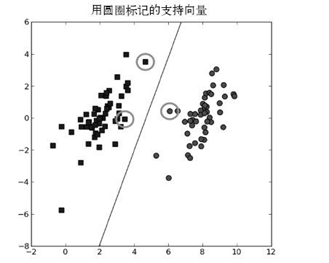
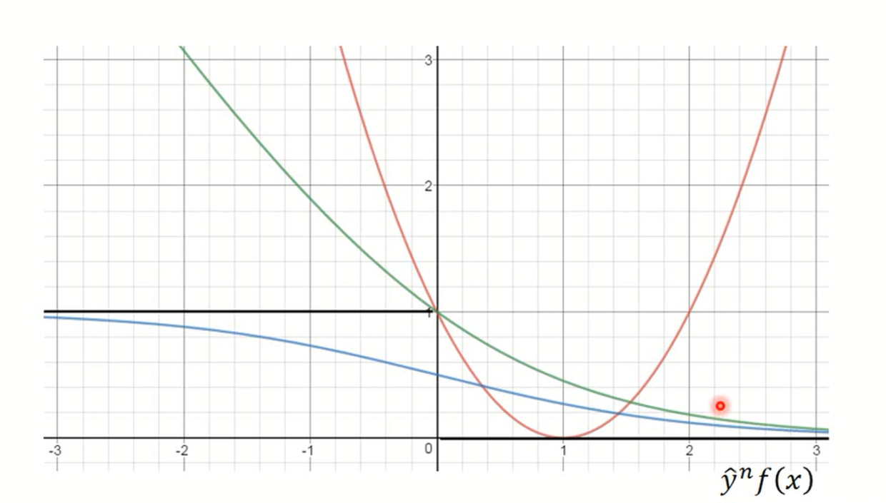
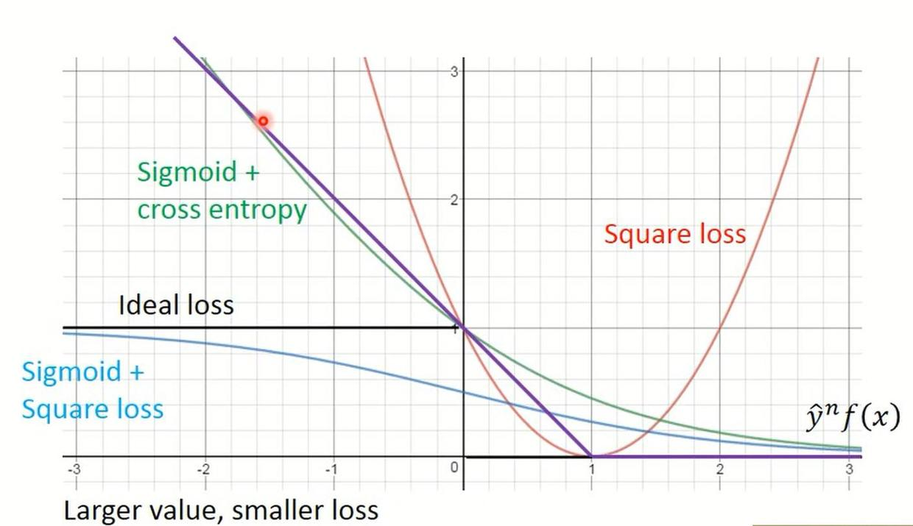
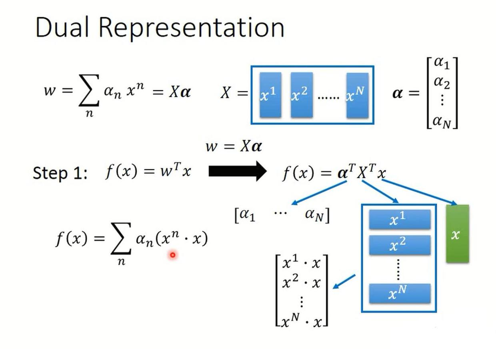
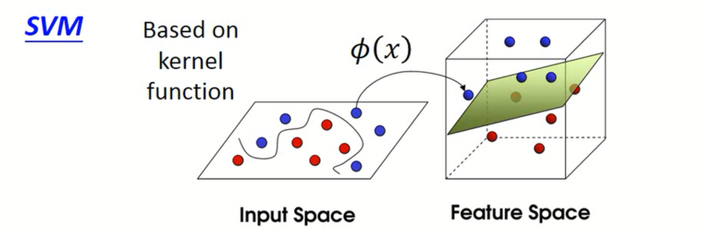
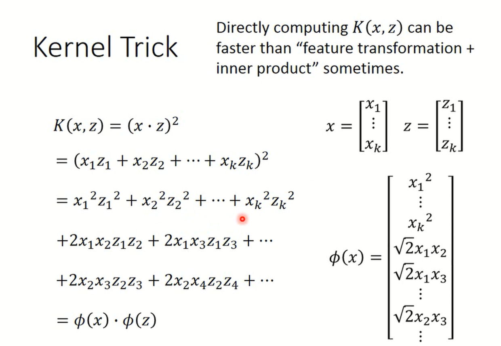

之前介绍了几种不同的监督学习算法以及测试集和验证集的概念：

- [线性回归](https://www.jianshu.com/p/258a12d263d0)
- [Logistic 回归](https://www.jianshu.com/p/d5491293bcaf)
- [神经网络模型](https://www.jianshu.com/p/0c5ad8a172d1)
- [训练模型的优化](https://www.jianshu.com/p/95b4c5f4bbdf)

这篇文章介绍监督学习中一个很强大，在学术界和工业界都很流行的算法——**支持向量机（Support Vector Machine，SVM）**，首先大致了解一下支持向量机的思想

### 支持向量机简介

支持向量机是用于分类问题的算法，支持向量机的基本思想是对于N维的数据，找到一个N-1维的超平面（hyperplane），作为数据分类的决策边界，确定这个超平面的规则是找到离分隔超平面最近的那些点，使它们离分隔超平面的距离尽可能远，因为这样可以使得训练出来的分类器更加健壮。离超平面最近的那些点就被称为支持向量（support vector），举个例子，对于二维的数据，支持向量机就要找到一个一维的向量来作为边界，如图所示：

### 线性支持向量机（Linear SVM）

在 Logistic 回归中，我们根据$\theta^Tx$是否大于0来进行分类，并且将两个类别分别记作1和0，这里我们则将两个类别分别记为+1和-1，即$y^n=1$或$y^n=-1$。当$f(x)=\theta^Tx$大于0的时候，预测为+1，并且$f(x)$越大越好；当小于0的时候，预测为-1，并且$f(x)$越小越好

所以其实线性支持向量机的假设函数和 Logistic回归的假设函数是相同的，不同的只是损失函数。下面我们来看一下怎么确定线性支持向量机的损失函数。

首先我们画出用不同函数作为损失函数时候的图像，将横轴记为$y^nf(x)$，这样的话，如果$y^n=1$，这时候我们希望$f(x)$越正越好，所以$y^nf(x)$越大，损失函数越小，$f(x)$越小，损失函数越大；而如果$y^n=-1$，这时候希望$f(x)$越负越好，所以$y^nf(x)$越大，说明$f(x)$越负，即损失函数就越小。所以，将横轴记为$y^nf(x)$更加方便，无论是$y^n=1$还是$y^n=-1$的情况，损失函数都是随着横轴递减的

之前我们曾经使用过 Square Error Cost 作为损失函数，这是一个二次函数，当$y^n=1$的时候，是$(f(x)-1)^2$，当$y^n=-1$的时候，是$(f(x-(-1)))^2$，因此总的可以写成$(y^nf(x)-1)^2$

在 Logistic 回归中使用的损失函数则是交叉熵（Cross-Entropy），统一了$y^n=1$和$y^n=-1$的情况后，可以写成$\ln(1+e^{-y^nf(x)})/\ln2$，其中除以了一个常数是不影响的。从下图看一下：

红色的曲线就是 Square Error Cost，显然违背了随着横轴递减的规律，因此不能采用；蓝线是 Sigmoid 函数加上 Square Error Cost，虽然满足递减的规律，但是变化趋势太小，损失函数的下降并不明显，而我们知道随着横轴增大，损失函数应该会下降很多；而绿色的曲线就是 Logistic 回归中使用的交叉熵，和蓝线对比起来，损失函数的下降趋势就很明显

那么在支持向量机中，使用的是叫做 **Hinge Loss** 的损失函数，它的图像就是下面的紫色的线：

具体的损失函数是：

$$l(f(x^n),y^n)=max(0,1-y^nf(x^n))$$

当$y^n=1$时，只要$1-f(x)<0$即$f(x)>1$，损失函数就为0了；

当$y^n=-1$时，只要$1+f(x)<0$即$f(x)<-1$，损失函数为0

也就是说，当$y^nf(x)>1$时，损失函数就是0，就算继续让$y^nf(x)$增大，也不会得到损失的下降；而当$y^nf(x)$在0到1之间时，虽然已经可以预测出正确的结果，但是对于 Hinge Loss 来说还不够好，还是有一定的损失，要比正确的结果好过一段距离之后，损失函数才会降为0。相比于交叉熵，Hinge Loss 更加健壮

所以概括一下，线性支持向量机使用的假设函数就是一个线性函数（$f(x)=\theta^Tx$），损失函数是 Hinge Loss 再加上一个正则化的部分，这是一个凸函数，因此我们可以使用梯度下降法来进行优化

### 松弛变量（Slack Variable）

先直观地理解一下松弛变量。支持向量机的目标是找到一个边界以最大化边界与支持向量的距离，但是有时有些样本点可能不满足间隔条件，这时引入一个松弛变量$\epsilon^n\ge0$，使间隔加上松弛变量满足间隔条件

我们来看一下 Hinge Loss 的部分，记：

$$\epsilon^n=max(0,1-y^nf(x))$$

由于我们的目标是最小化 Hinge Loss，因此上式等价于：

$$\begin{align} \epsilon\ge1-y^nf(x) \newline\ \epsilon^n\ge0\end{align}$$

变化之后：$y^nf(x)\ge1-\epsilon^n$，就是说**间隔（margin）**要大于等于1，但是这个间隔是软间隔（soft margin），其中有一个松弛变量，就是$\epsilon^n$

这是一个**二次规划（Quadratic Programming，QP）**问题，因此可以用QP问题的算法来解。当然，不用QP算法的话用梯度下降法也是可以的

### 对 Hinge Loss 使用梯度下降法

忽略掉正则化的部分，线性支持向量机的损失函数就是：

$$L(f)=\sum_nl(f(x^n,y^n))$$

$$l(f(x^n),y^n)=max(0,1-y^nf(x^n))$$

如果我们的参数是$\theta$，我们首先需要求出损失函数对$\theta$的偏导数：

$$\frac{\partial l(f(x^n,y^n))}{\partial \theta_i}=\frac{\partial l(f(x^n,y^n))}{\partial f(x^n)}\frac{\partial f(x^n)}{\partial \theta_i}$$

由于$f(x^n)=\theta^Tx^n$，因此$\frac{\partial f(x^n)}{\partial \theta_i}=x_i^n$

接下来计算$\frac{\partial l(f(x^n,y^n))}{\partial f(x^n)}$：

$$\frac{\partial max(0,1-y^nf(x^n))}{\partial f(x^n)}=
\begin{cases}
-y^n, & if \ \ \ y^nf(x^n)<1 \\
0, & otherwise
\end{cases}$$

因此，偏导数为：

$$\frac{\partial L(f)}{\partial \theta_i}=\sum_n-\delta(y^nf(x^n)<1)y^nx_i^n$$

我们把$-\delta(y^nf(x^n)<1)y^n$记作$c^n(\theta)$，其中$\delta(x)$表示当满足$x$时，$\delta(x)$为1，否则为0

于是，我们就得到了在 Hinge Loss 中，梯度下降法的更新公式：

$$\theta_i=\theta_i-\alpha\sum_n c^n(\theta)x_i^n$$

### 核函数（Kernel Function）

将我们最终使用梯度下降法得到的那组最优化的参数记作向量$\theta^*$，实际上，$\theta^*$就是$x^n$的线性组合：

$$\theta^*=\sum_n a_n^*x^n$$

将梯度下降法的更新公式写成向量的形式：

$$\theta=\theta-\alpha\sum_n c^n(\theta)x^n$$

而前面说过$c^n(\theta)$很多时候都会是等于0的，因此对应最后的参数$\theta^*=\sum_n a_n^*x^n$，就会有很多数据点$x^n$前面对应的$a_n^*$是等于0的，也叫做$a_n^*$是**稀疏的（sparse）**，而那些$a_n^*$不等于0的$x^n$就叫做**支持向量（Support Vectors）**

意思就是如果一个数据点对应的$a_n^*$等于0，那么这个数据点对模型一点作用都没有，只有当它对应的$a_n^*$不等于0，它才会对决定最后的模型有用。只有少数的点会被选作支持向量，如果出现了异常值（outlier），那么只需要保证不把它选作支持向量就行了。比如如果是用的交叉熵作为损失函数，那么损失函数在每个地方的微分都是不等于0的，所以最终的$a_n^*$也不会是稀疏的，那么每一个数据点对最后的模型都会有影响，所以相比于其他模型，支持向量机是比较稳健的（robust）。

将式子$\theta^*=\sum_n a_n^*x^n$矩阵化得到：$\theta=Xa$，则：

$$f(x)=\theta^Tx=a^TX^Tx=\sum_n a_n(x^n*x)$$

具体的矩阵变换如图（图中的$w$就是指$\theta$）：

接下来，我们将假设函数写成带核函数的形式：

$$f(x)=\sum_n a_nK(x^n,x)$$

其中的$K(x,z)$就是**核函数（Kernel Function）**，如果不作任何映射直接作内积，就称为线性核，得到的就是之前的线性支持向量机。

之前构造的线性支持向量机没有作数据的映射，因此只能用来分隔线性的数据。如果数据线性不可分，就需要将$x$映射到$\phi(x)$，映射到高维空间之后得到线性可分的数据：

这样带来的问题是如果维度较高会导致计算量爆炸，因此使用核技巧（Kernel trick）可以帮助我们在高维映射下计算SVM，举个高维映射的例子：

这样，计算$\phi(x)*\phi(z)$就可以通过计算核函数$K(x,z)=(x*z)^2$来计算，避免了显式地写出映射后的结果，直接使计算量小了很多

在实际应用中，不需要去考虑如何映射，而是可以直接选择核函数，通常我们会从一些核函数中选择，例如：

- 线性核函数：$K(x,z)=<x,z>$（向量内积）
- 多项式核函数：$K(x,z)=(<x,z>+R)^d$
- 高斯核函数，高斯核函数是最常用的，可以将数据映射到无穷维，也叫做径向基函数（Radial Basis Function，RBF）：
$$K(x,z)=exp(-\frac{||x-z||^2}{2\sigma^2})$$

最后，放张图总结一下支持向量机：

参考：
- [李弘毅机器学习--支持向量机](https://www.bilibili.com/video/av10590361/?p=31)
- [支持向量机系列--Freemind](http://blog.pluskid.org/?page_id=683)
